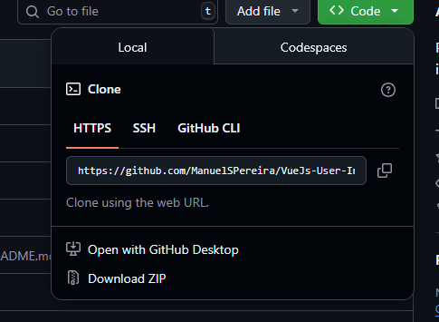
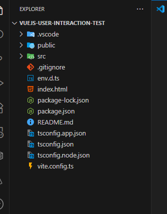
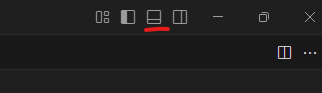
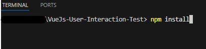
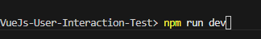
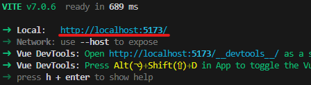

# Instalacion

## Requisitos
- Tener instalado Node js
https://nodejs.org/en/download

- Tener instalado Visual Studio Code
https://code.visualstudio.com/

## Pasos
1. Descargar el Repositorio

2. Abrir la carpeta en Visual Studio Code

3. Ejecutar "npm install" en la terminal

4. Ejecutar "npm run dev" en la terminal

5. Abrir el enlace en el navegador

