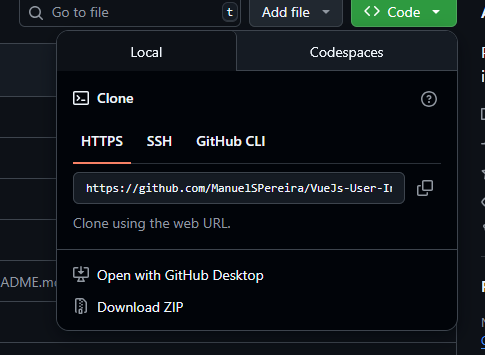
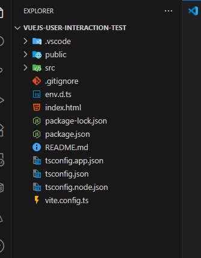
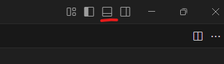
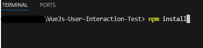
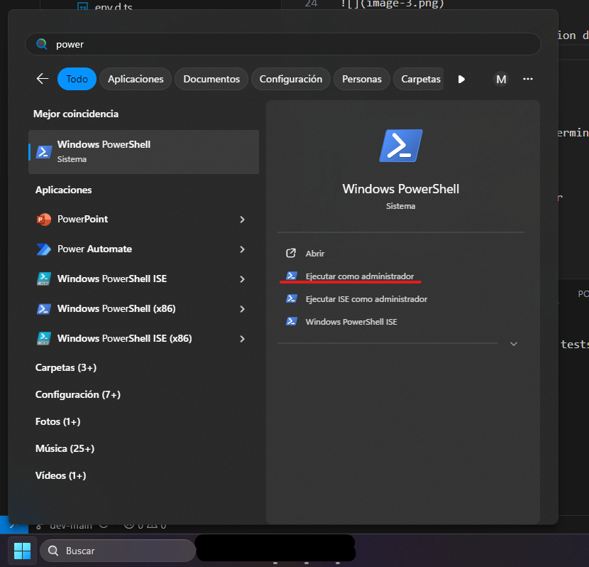
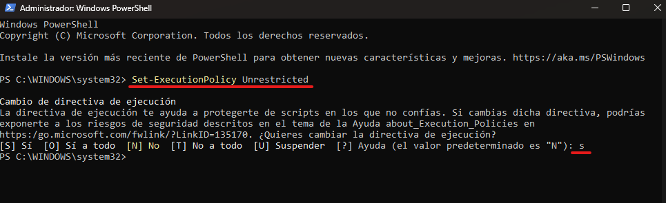
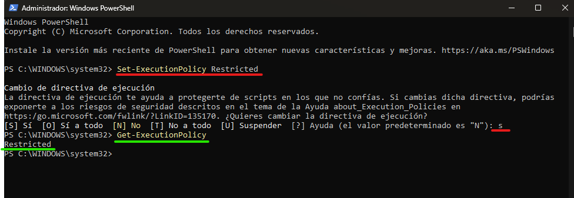
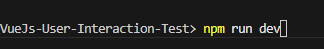
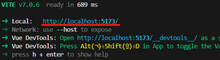

# Instalacion

## Requisitos
- Tener instalado Node js
https://nodejs.org/en/download

- Tener instalado Visual Studio Code
https://code.visualstudio.com/

## Pasos
1. Descargar el Repositorio

2. Abrir la carpeta en Visual Studio Code

3. Ejecutar "npm install" en la terminal

3.A En caso de error en la ejecucion del comando en relacion con "Execution Policy", se debe abrir Powershell como administrador e introducir el comando "Set-ExecutionPolicy Unrestricted" y confirmamos ingresando "s"

3.B Para revertir los cambios, se realiza lo mismo que en el paso 3.A, con la diferencia que se ingresa el comando "Set-ExecutionPolicy Restricted" en vez del anterior. Se puede ver el valor actual con el comando "Get-ExecutionPolicy"

4. Ejecutar "npm run dev" en la terminal

5. Abrir el enlace en el navegador

